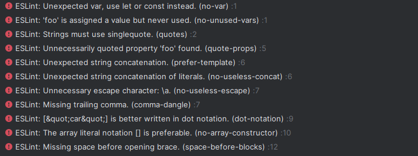

# Formatting Code Like An Essay

This is all about following certain guidelines to keep the code looking uniform throughout. I mainly use Visual Studio Code, and I always follow a certain guideline as to how my code is presented. I like my code being readable, it doesn't just look like a bunch of spaghetti code put together. For example, using tons and tons of else if statements, when you could just use a switch statement, or return earlier, so it does not fall through. Or maybe you have way too many conditions just for an if statement, when you could just split them up. I have done this countless times, and it always felt that the code was not up to my standards, especially when we do code reviews, and I see other peoples code that isn't just a mess. And I do think programmers should do at least some `code review` because when you do finally land a job its highly likely that you will be put into a code review session. 

# What is a code review?

You can think of code reviews as peer reviews. It is an act of quality assurance of the code base. After a developer has completed his code, a code review is an important step to get a second opinion on the solution before ultimately implementing. As someone who has participated in a code review before, it is not an event where we should insult and laugh at other programmers, it is an event where we help improve programmers, and maybe even set guidelines on how code should be formatted. It is an event, where we learn new programming techniques from your peers.

# Experience with ESLint

I have never really used any type of linting tools till now, mainly because I like to follow my own coding standards. For example, I never use curly brackets for any conditional statements such as a for statement or an if statement, if you are only using one line of code.
Or, if you are in a function keep the code indented, so that I know that this code is for this particular function. In particular, I agree that coding standards help learn a programming language. When I started programming, I had never used any linting tools. I started coding in vim with the C Programming Language, so if you made any syntax errors, the only thing that will tell you is the compiler. I find that you learn more if there are errors. And so, my experience with ESLint has been great, this is how I learned to program, and it is a lot faster than compiling a C program, and reading off from the compiler, but that is also one of the reasons I ultimately switched over to Visual Studio Code, is because I can check these syntax errors, without compiling it. I am loving ESLint so far, I may look into more linters for other programming languages.
