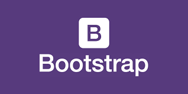

# Into the Unknown

The first thing that comes to mind when I think about Software Engineering is Software Development, but it’s not that. In my opinion Software Engineering is the really about the design, development, testing and maintenance of software applications. In the case of what we have done in class are website development. Going into the class, I’ve already had a good experience with JavaScript and GitHub, but that was it. Everything going forward is unknown to me. The idea of software engineering was still completely unknown to me, but as I continued learning about software engineering, software engineering is a lot deeper than I thought.

# Coding Standards

Coding Standards is basically like rules you follow to make your code more uniform throughout. I have learned a lot about coding standards. I have applied coding standards before, but not with Linters. I absolutely have been loving what ES Lint does. It keeps all my code uniform, and it fixes some bad habits of mine. For example, if I am making an Arrow function, and I am returning one line of code, I always put a return statement there, when it’s not needed. I will continue to use coding standards, whether I am making a neural network in Python, or making a video game in Unity. To me coding standards are very important, and every programmer should have some sort of coding standards that they should follow.

# User Interface Frameworks

Again, I have learned HTML and a bit of CSS, but nothing too serious, but Bootstrap 5 is a real game changer for UI Design. When we purely used HTML and CSS for making websites, it was a painful experience because it just felt so restricting, especially when we tried to copy websites. Bootstrap 5 allowed for easy access to styling and that’s why I loved it so much. Similarly, we also have reactJS. React is a component-based UI framework in JavaScript. This allowed you to add JavaScript code to your websites essentially. Note that React works like HTML. React brought a lot of functionality, and it also had bootstrap built into it. Outside of UI, is frameworks in general. I have used frameworks such as OpenAI, PyTorch and TensorFlow. I think people need to see that these are not built into the Programming Language, but they kind of work like plugins. Frameworks is one way to bring a lot more functionality to the programming language.

# Agile Project Management

Agile Project Management is essentially an efficient way for teams to manage their projects. At first, I didn’t really like the idea of this, however, working in a team I know the importance of managing your projects. At first, I thought this was just too tedious to follow, but really it just made managing your project easier. Let’s first talk about the Issue Driven Project Management (IDPM). Essentially, what IDPM is you set yourself up with Milestones. All Milestones have an end-date. Issues are then assigned to this milestone, and then the team will divide the issues amongst themselves. Preferably, you want all these issues done by the milestone end-date, but you can move those issues to the next milestone. I find these very helpful because when you have multiple people working on a codebase you don’t want to deal with merge conflicts. You can prevent this issue by using IDPM. And I do see myself continuing to use this type of management because I will be working with hundreds of programmers on just one codebase, and that will be harder to manage compared to a team of four.
