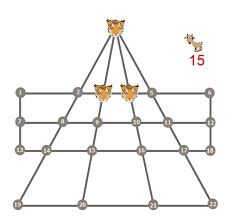

## What is it?

Basically, having an AI learn to play videos games. I think with AI you have to have some patience, you cant just expect them to play right off the bat. What I find so interesting is just the amount of things you can do with AI, but also the amount of compute power an AI might need is also quite insane, I am still currently trying to train my AI through reinforcement learning, but my current system that I have it working on is quite limited. This is still a WIP progress, it is not easy training an AI to play games.

I also have an x96 project that I am doing. We are training a game that the Professor Narayana has specifically made. Its a game about Tigers and Goats, where there are three tigers on a board (which is the games AI not the neural network AI) and the player which is the goats. The Goats need to be placed on to the board such that they can't be eaten. The tiger will only eat a goat if there right next to the goat and there is a space behind the goat. Kind of like how checker pieces move. As the Goats you want to trap the tigers so that they cannot freely move on the board. We made a neural network from scratch in TensorFlow/Keras. We are going to expand this neural network but we will need alot more compute power.