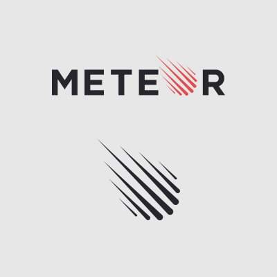

## What is UHConnect?

UHConnect is a web application that is developed by Vinton Sistoza(me), Kyle Takeda, Tanner Berry, Andrew Wan, and Lloyd Sanderson. It is built on Meteor, React, and MongoDB. UHConnect is essentially a place where Companies can share their jobs/opportunities with more specifically UH Students. Similarly for students, it is a place to find jobs before they eventually graduate.

## Features

Upon registering to our website, you have two roles to choose fromOur Web Application features a collection of Jobs, which students can go and view. If a student wants to apply for a job, it has a link to the company website. Companies can post jobs onto our website, and enter a link to connect there website to ours. Students also have a feature to enter a profile if they desire too. Note profiles are optional, but it lets Companies openly find recruits that are perfect for the job. One more thing to note is that if you ever find a job or recruit that you want, but want to wait for a bit. There is a kind of like a shopping list, where we can save either jobs or profiles too.

## My Contributions

I mostly worked on the ideas surrounding our app, but also the functionality behind it. Such as the Job Listings, Profiles, the Shopping Cart, Recruit Page are all done by me. What I have learned from doing this project is mostly trying to manage the project within a group. I do expect to work with a lot more people than just the four that were working on this project, so doing this project was valuable experience to me.

## Link to GitHub Project

<a href="https://github.com/uh-connect/uh-connect">Click Me!</a>