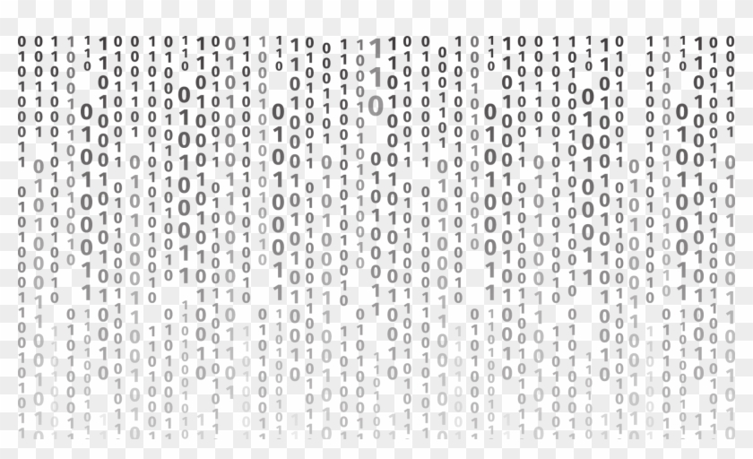
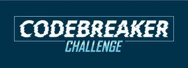

## What is the NSA Codebreaker Challenge?

Basically, this is a challenge where you are up against schools/universities. The more tasks you do, the more points you acquire to further boost your rank on the scoreboard. Again the main task is to hack your way through these tasks, given what you have learned so far. As far as I know, I can't get too much into this as it is supposed to be classified, as this is a recurring event, as to not help other students taking this challenge as well. I guess the the winning condition would be get within the top 5% on the scoreboard.

## What does it teach you?

In essence, it is supposed to teach you about cybersecurity and how hackers operate. And through this you will learn a bunch of things that you probably havent used before, such as Ghidra, WireShark, and Git. You can think of the NSA Codebreaker as an opportunity to get a chance to work at NSA, unfortunately for me, I had fun doing codebreaker. Though, I had better interests in mind.